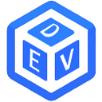

# DevBox

后端(djangorestframework)

前端(Vue) https://github.com/824750130/dev_box_vue.git

整合程序员开发工具的一款在线开发者平台


## 环境准备

python ^3.6

mysql ^5.6 或 mariadb ^5.5

redis


## 安装

1.安装环境python3&mysql&redis


2.启动构建程序

```shell
python3 build.py
```


3.确认服务配置

```shell
vi config/server_conf.py
```


4.启动服务

```shell
# 启动服务
python3 devsm.py start
# 关闭服务
python3 devsm.py stop
# 重启服务
python3 devsm.py restart
```


5.创建用户
```shell
python3 manage.py createsuperuser
```

## docker启动

1.安装环境docker&mysql&redis


2.构建docker容器

```shell
docker build --tag=dev_box .
```


3.启动容器

```shell
# -p 端口映射 宿主机开放端口:容器中服务端口
docker run -p 8001:8001 -p 8000:8000 dev_box
```


